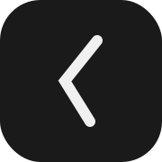

# Less Timer

A minimalist meditation timer focused on simplicity and mindfulness.



## Features

* **Clean, Distraction-Free Interface**: Black background with minimal UI elements
* **Flexible Timer Settings**:
  * Optional time limits from 1 to 60 minutes
  * Customizable recurring chimes (1, 2, 5, 10, or 15-minute intervals)
* **Health Integration**: 
  * Apple HealthKit write integration for tracking meditation sessions
  * Records mindfulness minutes automatically
* **Customizable Experience**:
  * Toggle sounds on/off
  * Optional vibration feedback
  * Recurring chime intervals

## Installation

### App Store
Less Timer is will soon be on the App Store for iPhone and iPad.

[](APP_STORE_LINK)

### Building from Source

1. Clone the repository:
```bash
git clone https://github.com/joshuabragge/Less-Timer.git
```

2. Open `Less-Timer.xcodeproj` in Xcode

3. Build and run the project using Xcode's build system (⌘+R)

### Requirements

* iOS 15.0 or later
* Xcode 15.0 or later
* Swift 5.0 or later

## Contributing

Contributions are welcome! Please feel free to submit a Pull Request. For major changes, please open an issue first to discuss what you would like to change.

1. Fork the Project
2. Create your Feature Branch (`git checkout -b feature/AmazingFeature`)
3. Commit your Changes (`git commit -m 'Add some AmazingFeature'`)
4. Push to the Branch (`git push origin feature/AmazingFeature`)
5. Open a Pull Request

## Supporting Our Community

Less Timer is proud to support:

* [Little Bee Gallery](https://www.littlebeegallery.com/)
* [Calgary Food Bank](https://www.calgaryfoodbank.com/)
* [Trees Canada](https://treecanada.ca/)

## Privacy

Less Timer takes your privacy seriously:
* No data collection
* All preferences stored locally
* Optional HealthKit integration
* No third-party analytics

Read our full [Privacy Policy](privacy-policy.md) for more details.

## License

This project is licensed under the CC BY-NC 4.0 - see the [LICENSE.md](license.md) file for details.

## Acknowledgments

* Icons and design elements created by Claude AI
* Sound effects from PixaBay
* All our contributors and users
